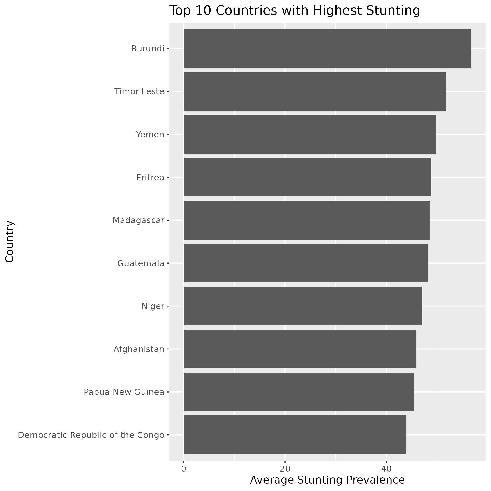
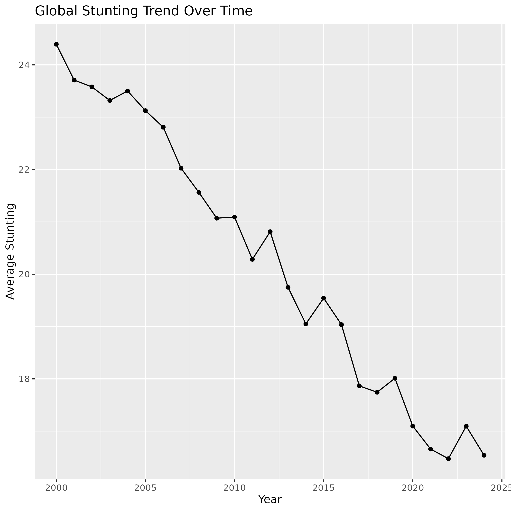
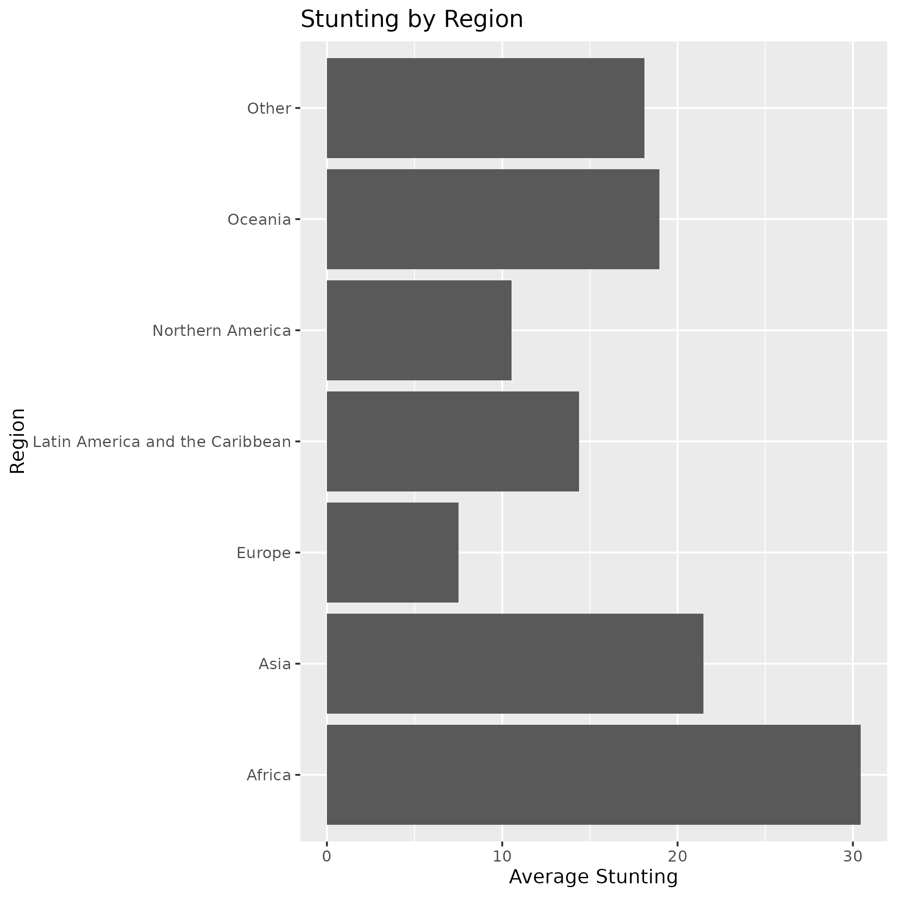
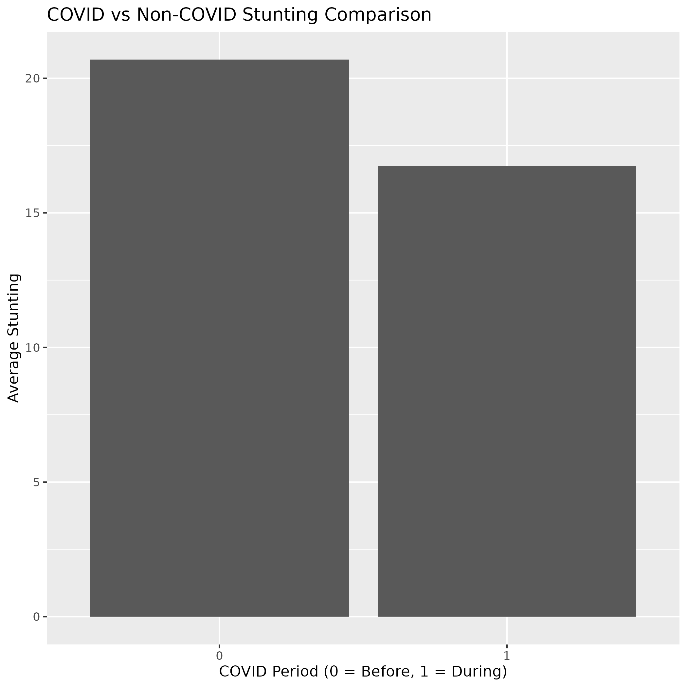

# UNICEF-Malnutrition-Analysis-using-R
Data analysis project on UNICEF child malnutrition dataset using R for EDA and visualization.
##  Story Behind This Project
Millions of children worldwide continue to suffer from chronic malnutrition, despite the fact that every kid should have a good start in life.

In order to determine which nations and areas are most impacted, how nutrition trends have evolved over time, and whether COVID-19 hampered global development, I examine UNICEF child malnutrition statistics from 2000 to 2024.

In this project, I use R for data analysis and visualisation to turn unprocessed public health data into insightful information that supports humanitarian decision-making and evidence-based policy.
## Theoretical Framework

Child malnutrition is classified by using WHO standards;

### Stunting (Chronic Undernutrition)
reflects poor living scenarios, frequent illnesses, and long-term malnutrition. Physical growth, cognitive development, academic success, and future economic production can all be permanently impacted by stunting.

### Wasting (Acute Undernutrition)
Results from rapid weight loss or failure to gain weight due to famine, disease outbreaks, displacement, or severe food shortages.

### Underweight
A composite indicator that captures elements of both chronic and acute undernutrition.

## UNICEF Framework of Malnutrition
According to UNICEF, malnutrition is influenced by three levels of determinants:

1. Immediate Causes  
   - Inadequate dietary intake  
   - Disease and infections

2. Underlying Causes  
   - Household food insecurity  
   - Poor sanitation and healthcare access  
   - Inadequate maternal and child care

3. Basic Causes  
   - Poverty  
   - Social inequality  
   - Conflict and political instability

I use correlation analysis, comparative regional analysis, and time-series analysis in this study to look at these worldwide differences.
## Project Objectives
- To analyze global child malnutrition trends from 2000 to 2024 using UNICEF data and understand how indicators like stunting, wasting, and underweight have changed over time.

- To identify countries with the highest levels of childhood stunting and observe which regions continue to face the most severe nutritional challenges.

- To compare malnutrition patterns across different regions and explore the differences between developed and developing countries.

- To study how the COVID-19 pandemic may have affected child nutrition by examining changes in malnutrition trends during and after the pandemic years.

- To explore relationships between different malnutrition indicators and understand how factors such as poverty, food insecurity, healthcare access, and living conditions may be connected to child nutrition outcomes.

- To improve my practical skills in data analysis, visualization, and storytelling using R programming tools such as ggplot2, dplyr, and tidyverse.

- To transform raw UNICEF data into meaningful insights that can help explain real-world public health and nutrition challenges.
  ## Tools & Analytical Methods
### Tools Used
- R Programming
- tidyverse
- ggplot2
- dplyr
- Kaggle Notebook
- GitHub

### Analytical Methods
- Data cleaning and preprocessing
- Exploratory Data Analysis (EDA)
- Grouped statistical summaries
- Time-series trend analysis
- Correlation analysis
- Comparative regional analysis
- Data visualization
  ## Key Questions Answered

1. Which countries have the highest stunting rates?
2. Has global stunting improved over time?
3. Which regions are most affected?
4. Did COVID-19 disrupt child nutrition progress?
5. How are malnutrition indicators related?
   ##  The Hardest Hit Countries
The analysis showed that countries like Burundi, Timor-Leste, and Yemen have some of the highest stunting rates in the dataset. In Burundi, almost more than half of children are affected by stunting, which reflects serious long-term nutrition and health challenges.

After exploring the data, I noticed that countries facing poverty, conflict, food insecurity, and weak healthcare systems generally had much higher malnutrition levels compared to more stable regions.

Overall, the results suggest that chronic child malnutrition is still heavily concentrated in parts of Sub-Saharan Africa and South Asia, where access to proper nutrition, healthcare, and living conditions remains limited.
## Global Progress Over Time

The trend analysis showed that global stunting prevalence gradually decreased from 24.4% in 2000 to 16.5% in 2024. This suggests that there has been overall improvement in child nutrition over the years.

In my opinion, this improvement may be linked to better healthcare services, vaccination programs, nutrition awareness, and international efforts by organizations working on child health and development.

However, after 2019 the decline becomes slower, which may indicate the impact of the COVID-19 pandemic. During this period, many healthcare and nutrition services were disrupted, and families in vulnerable communities faced increased economic and food security challenges.
## Regional Disparities

The regional comparison showed clear differences in malnutrition levels across the world. According to the analysis, African countries had the highest average stunting prevalence, while several Asian countries also showed relatively high malnutrition rates.

On the other hand, European countries had much lower levels of child malnutrition compared to other regions. While interpreting these results, I observed that regions with stronger healthcare systems, better living conditions, and higher food security generally showed better child nutrition outcomes.

This analysis highlights how economic conditions, healthcare access, and social development can strongly influence child health and nutrition.
## COVID-19: A Hidden Setback?

When I compared the COVID and non-COVID periods, the dataset showed a lower average stunting prevalence during the pandemic years. However, after interpreting the results more carefully, I realized that this decline may not necessarily represent a real improvement in child nutrition.

One possible reason could be the disruption of household surveys and nutrition monitoring systems during lockdowns, which may have affected data collection and reporting accuracy.

Based on reports and studies from different countries, it is likely that many vulnerable communities actually faced increased food insecurity and reduced access to healthcare services during the pandemic, which may have negatively affected child nutrition outcomes.
## Correlation Between Indicators

The correlation analysis showed a strong positive relationship between stunting and underweight prevalence. While exploring the results, I noticed that countries with high stunting levels often also had high underweight prevalence, suggesting that multiple forms of undernutrition tend to occur together.

This indicates that long-term nutritional deprivation not only affects children’s height growth but can also influence their overall physical development and health outcomes.

I also observed that overweight prevalence had a much weaker relationship with undernutrition indicators. This reflects the global “double burden” of malnutrition, where some countries continue to struggle with hunger and undernutrition, while others are increasingly facing problems related to overweight and obesity.
## Visualizations

### Top Stunting Countries

### Global Stunting Trend

### Regional Comparison

### COVID Impact

## Conclusion

Through this project, I explored global child malnutrition trends using UNICEF data from 2000 to 2024 and gained a better understanding of how nutrition outcomes vary across countries and regions.

The analysis showed that some regions, particularly Sub-Saharan Africa and parts of South Asia, continue to experience a much higher burden of chronic undernutrition compared to other parts of the world.

I also observed that although global stunting prevalence has generally declined over the last two decades, the rate of improvement appears to slow after 2019, which may be linked to the indirect effects of the COVID-19 pandemic on healthcare systems, nutrition services, and food security.

Another important finding from the analysis was the strong relationship between different forms of malnutrition, especially stunting and underweight, suggesting that these challenges are often interconnected and influenced by common social and economic factors.

Overall, this project helped me strengthen my understanding of real-world public health data analysis and showed how data-driven insights can support policymakers, NGOs, and international organizations in making better decisions to improve child nutrition outcomes worldwide.
## Future Improvements

To further enhance the scope and impact of this analysis, the following extensions can be implemented:

- **Predictive Modeling:** Development of machine learning models to forecast future trends in child malnutrition based on historical and socio-economic indicators.

- **Interactive Dashboards:** Creation of dynamic dashboards using tools such as Power BI or Tableau to enable real-time exploration of malnutrition indicators across countries and regions.

- **Geospatial (GIS) Analysis:** Integration of spatial mapping techniques to visualize regional disparities and identify high-risk geographic clusters.

- **Time-Series Forecasting:** Application of statistical forecasting methods to analyze long-term trends and predict future changes in malnutrition prevalence.

- **Policy-Oriented Reporting:** Transformation of analytical results into actionable insights to support policymakers, NGOs, and international organizations in designing targeted interventions.
  ## Author
**Rizwana Farooq**
MPhil Statistics Student | Data Analytics Enthusiast
GitHub: https://github.com/Rizwana-Farooq
